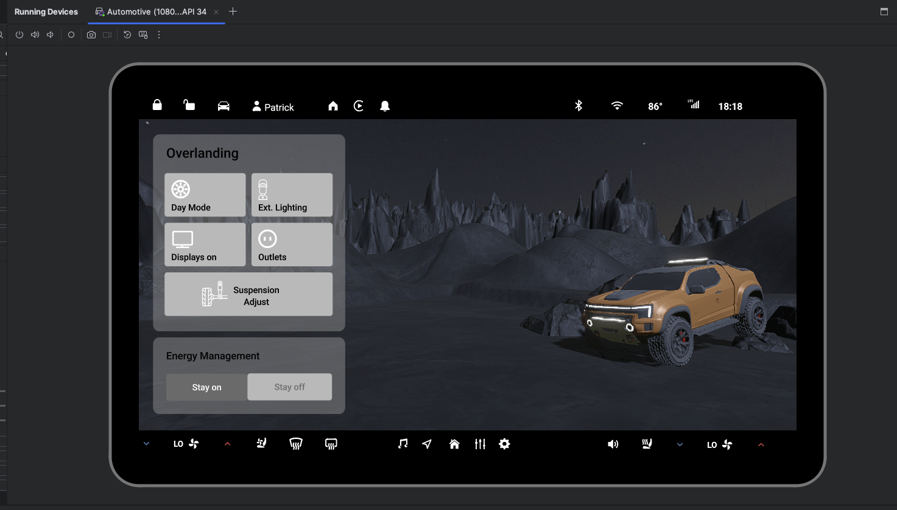

# QtAndroidActivityView3D

## Description
This project was created as a demonstration of integration of a Qt 2D UI with a 3rd-party 3D renderer via the Qt Android Activity View.  The 2D assets have been bridged in from Figma via the Qt Bridge for Figma plugin

## Screenshots

## Prerequisites
In order to successfully build and run this demo the following are required:

*Qt 6.8 or later (including Qt for Android Automotive)
*Qt Creator (with Android Kit setup)
*An Android Automotive OS device with a valid platform key to sign the APK

